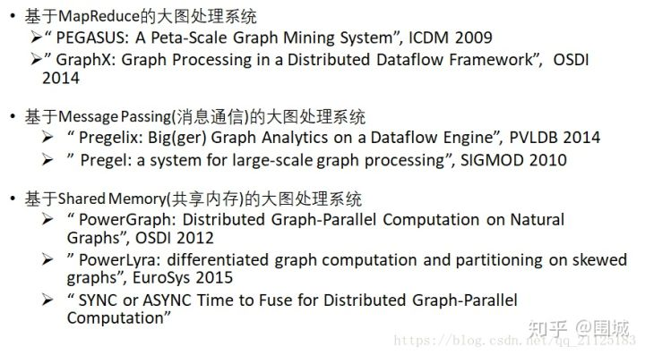

# 图处理系统概述
## Background
图数据是日常生活中十分常见的数据类型，比如人与人之间的关系，不同网页之间的相互链接，甚至社交账号之间的点赞。这些都可以通过graph类型的数据进行表示。

随着时间的推移，图结构的数据成几何的指数增长，目前的图结构已经达到了TB级别的数据量。所以如何对这么大量的图数据进行高效处理就成为了一个新的挑战。

图一般表示为G(V, E)，也就是顶点集 + 边集

大规模图数据的主要特征有：
1. 数据规模大
2. 幂律图，顶点的度数不均匀，高度数的顶点较多，低度数的顶点较少。

## 图处理系统
图处理系统最初是单机的并行处理系统，比如Ligra，Polymer。但是随着图数据的规模不断增加，单机已经承受不住了，所以图处理系统向着四个不同的改进方向迈进。

1. 第一个维度就是分布式图处理系统：利用集群资源对图计算进行并行加速，这个维度图处理系统最大的瓶颈就是网络通信。
2. 第二个维度就是核外图处理系统：利用外部存储磁盘和内存进行不断地交互，解决内存装不下整个图数据的问题。这个维度的图处理系统最大的瓶颈问题就是磁盘空间大小。
3. 第三个维度就是NUMA-aware架构的图处理系统：利用新型NUMA架构加速图计算的过程，每个NUMA 节点都有自己的核以及内存。这个维度图处理系统最大的问题就是图很难被分区。
4. 最后一个维度就是新型硬件加速的图处理系统：利用新型硬件加速图处理的过程，这个新型硬件可以有GPU加速、RDMA加速、PIM 指令集卸载。

## 分布式图处理系统

图处理系统主要可以分为以下三类（道听途说）
1. 基于mapreduce/spark框架的图处理系统，典型代表就是GraphX
2. 基于消息通讯（message passing）的大图处理系统，其中最典型的就是Pregel基于BSP的大图处理系统，比如Pregelix和Pregel。（Google牛逼！）
3. 第三个就是基于Shared Memory（共享内存）的大图处理系统。其中包括PowerGraph和PowerLyra以及PowerSwitch 之前的文章中提到过。

## 分布式图处理系统面临的挑战
1. 图很大，需要分散到各台机器上，所以如何分割图是一个很大的问题。
2. 集群机器之间互相通信的开销会限制分布式图处理系统的整体性能。

