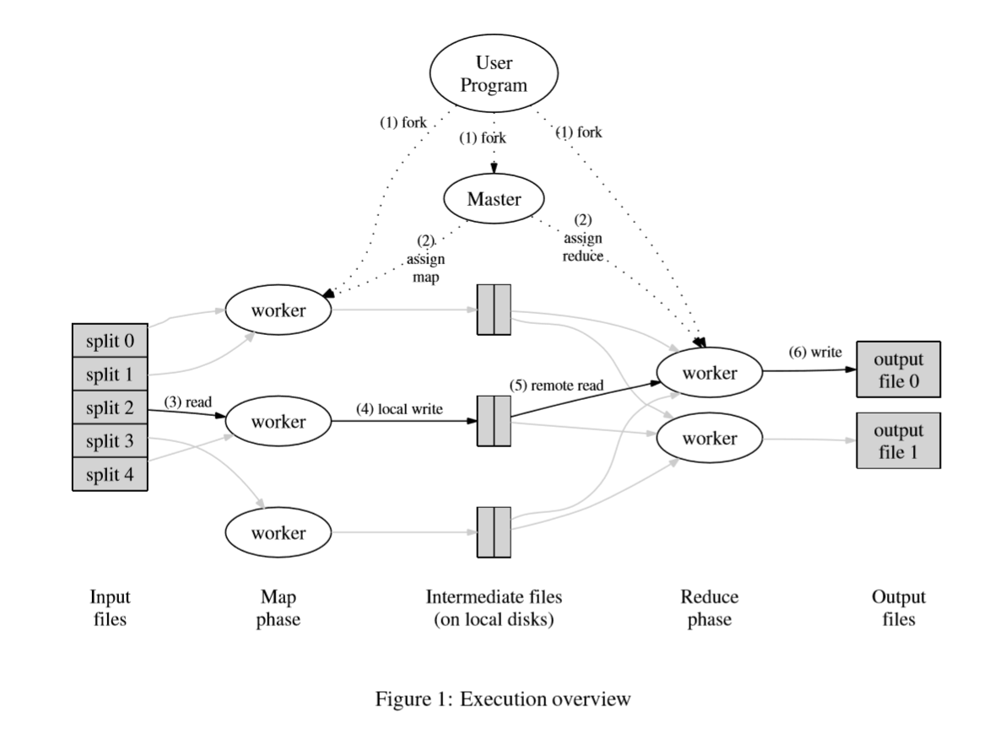

# MapReduce  
## Abstract  
MapReduce是一种编程的模型，模型处理的数据都是 key-value 对（以下简称k-v），用户需要定义一个map函数和一个reduce函数来完成相应的任务。  
初始的 k-v ——> map ——> 中间 k-v  
中间 k-v ——> reduce ——> 最终 k-v  
用户不用关心如何使用分布式的集群环境，这些都由框架做掉，包括有
1. 输入数据的划分  
2. 如何调度任务  
3. 错误处理和恢复  
4. 机器间通信
## Introduction  
1. details of parallelization
2. fault-tolerance
3. data distribution
4. load balancing
## Programming Model  
模型输入:key-value对
模型输出:key-value对  
用户需要定义map函数和reduce函数  
1. map函数对原始的输入进行一些处理，然后输出一些中间的k-v对，这些k-v对之后就会作为reduce函数的输入  
2. reduce函数也是对k-v对进行处理，它处理的方式是，对于map输出的那些k-v对，reduce每次都对k一样的k-v对进行处理，最终产生的结果k-v对中，不会存在相同的k  
     
举个例子：统计一个文档里面每个词出现了多少次  
假设输入文档叫 resume.txt，里面的内容是 "My name is Zhou. My idol is Ysy"  

那么输入k-v为：（"resume.txt", "My name is Zhou. My idol is Ysy") 也就是文档的名字作为key，文档的内容作为value。

上面的输入首先需要map函数进行处理，那我们的map函数作用可以简单的定义为输出每个单词，也就是说输出为：
1. ("My", 1)
2. ("name", 1)
3. ("is", 1)
4. ("Zhou", 1)
5. ("My", 1)
6. ("idol", 1)
7. ("is", 1)
8. ("Ysy", 1)  
     
上面的就是map函数的输出了，也就是reduce函数的输入。在输入reduce函数之前，框架会首先按照k进行排序（排序的目的就是为了让 k 一样的在一起），然后合并k一样的k-v对。   

排序后：  
1. ("My", 1)
2. ("My", 1)
3. ("name", 1)
4. ("is", 1)
5. ("is", 1)
6. ("Zhou", 1)
7. ("Ysy", 1)  
8. ("idol", 1)  
   
合并后k没有变化，但是v从一个值变为了一个列表  
1. ("My", [1, 1])
2. ("name", [1])
3. ("is", [1, 1])
4. ("Zhou", [1])
5. ("Ysy", [1])
6. ("idol", [1])

reduce函数会接着对上述内容进行进一步处理，在这个例子中比较简单，就是把相同k对应的列表中的数值累加起来就可以了，最终输出：  
1. ("My", 2)
2. ("name", 1)
3. ("is", 2)
4. ("Zhou", 1)
5. ("Ysy", 1)  
6. ("idol", 1)  

上述例子比较简单，其实生活中有很多复杂的任务也可以用map-reduce框架去完成，其实map-reduce的关键就在于如何设计map函数的输出。
## Implementation  
  

上面这种图很好的解释了map-reduce框架的工作原理，下面我具体解释一下，可能和原文顺序有一些差别  

1. 首先把输入数据分为M块，每一块也就对应了一个map任务，一般大小为16MB~64MB，可以由用户控制
2. 程序会被复制多份，每个机器上会保留一份，有一台机器叫master负责任务分配，其余都是worker负责具体的执行map或者reduce任务
3. 与map任务类似，reduce也有R个任务，具体由用户指定
4. 如果一个worker被分配到了一个map任务，那么他会从对应的输入数据split中读取相应的内容，做一些解析，然后调用map函数处理相应的数据。map函数的输出会被缓存在内存中，并定期地写入本地磁盘。（这里要注意，由于写入不是由master控制的，所以GFS的备份功能没有启用）
5. 写入磁盘的数据会被分割为R份，每一份对应一个reduce任务，这里的分为R份指的应该就是R个文件，由一个分割函数来决定如何划分，这个函数也可以由用户指定。
6. 
## Backup Tasks  
## Refinements  
## Performance  
## Experience  
## Related Work  
## Conclusion  
